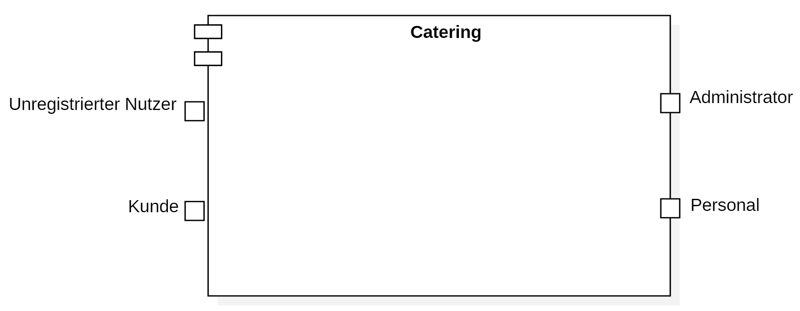
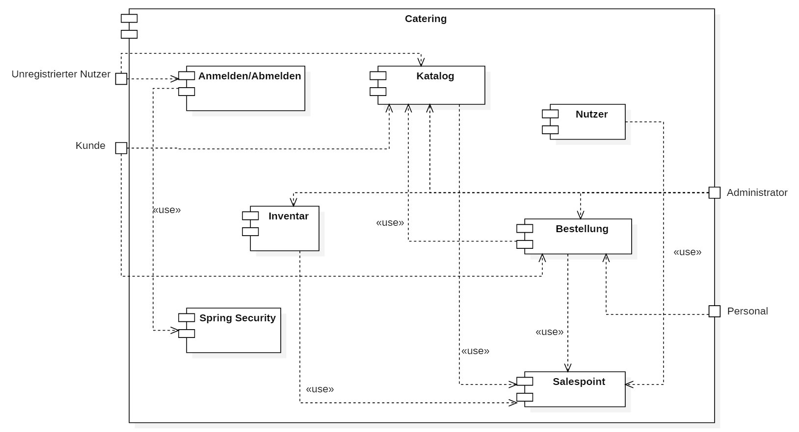
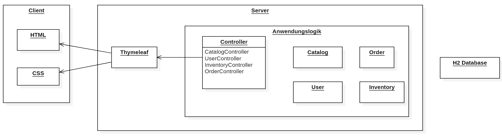
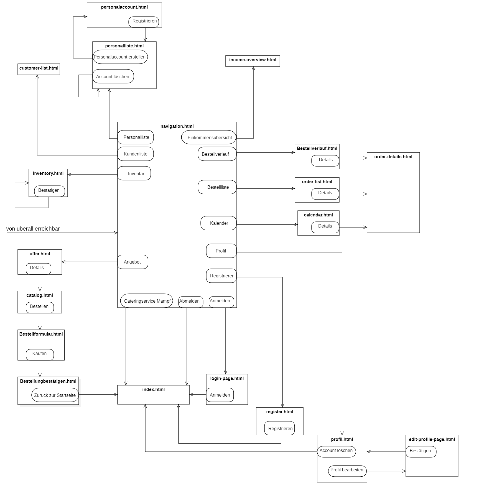
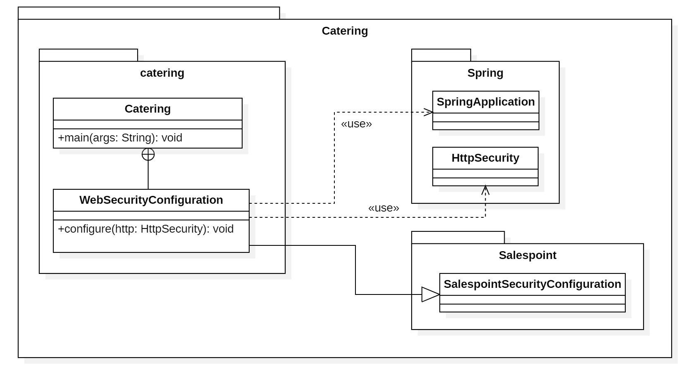
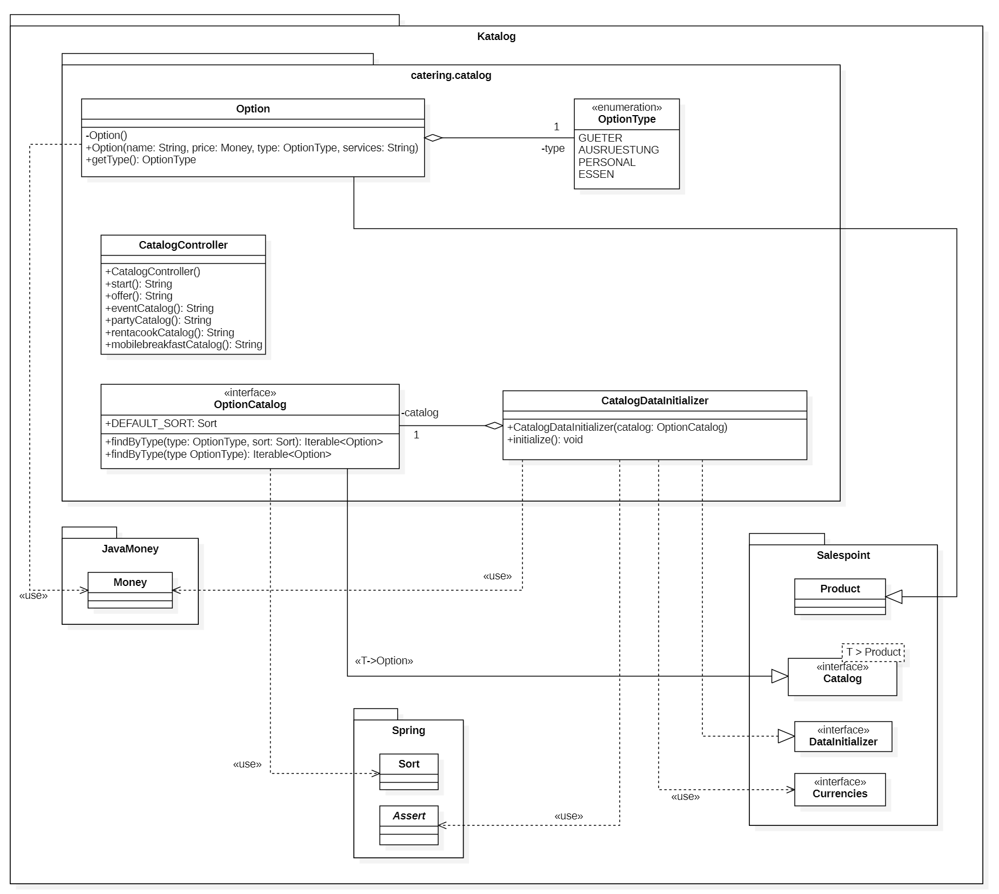
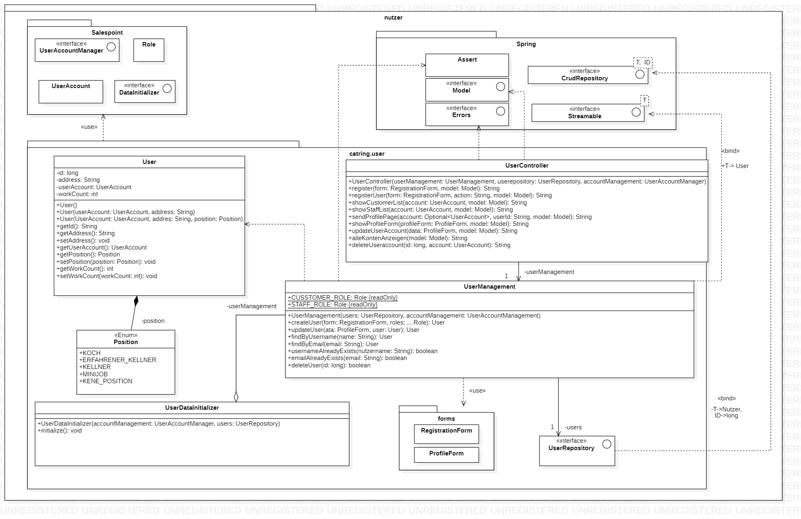
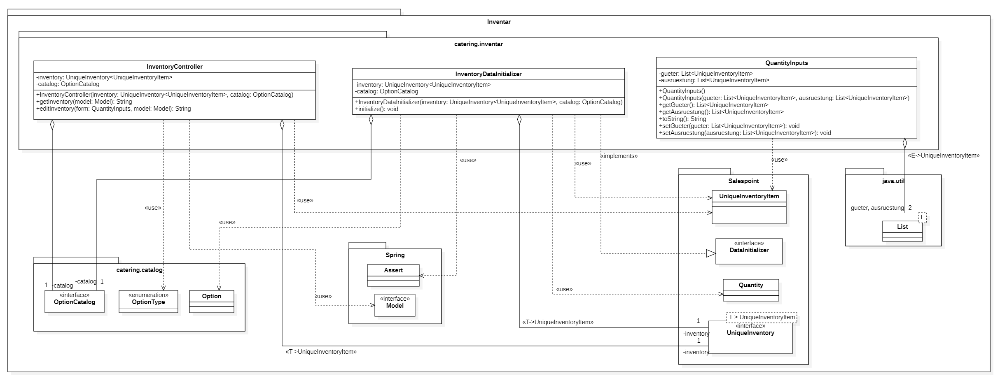
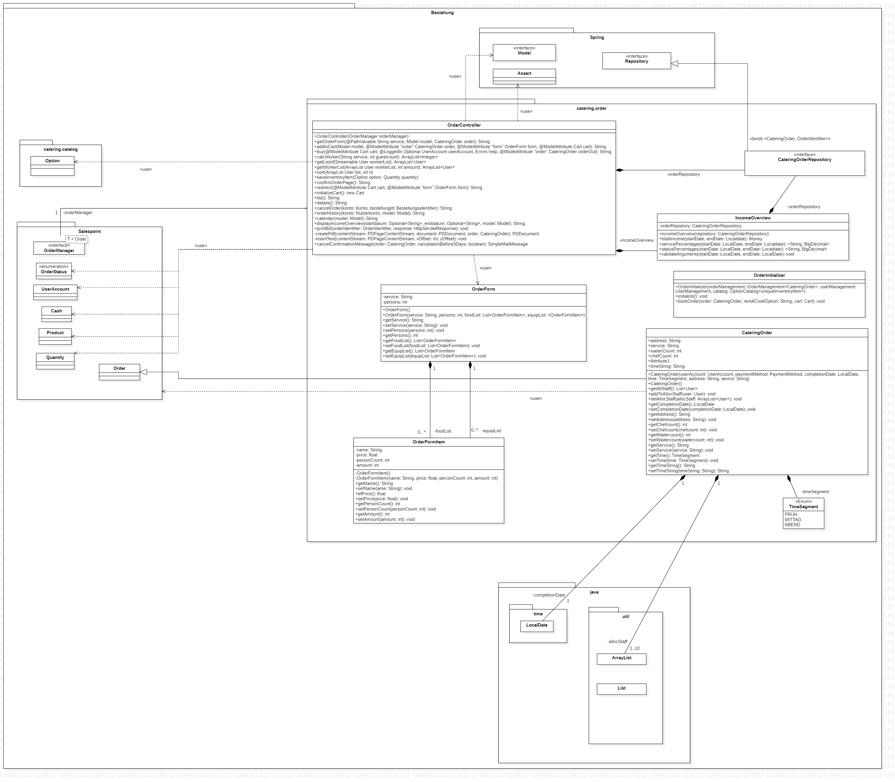
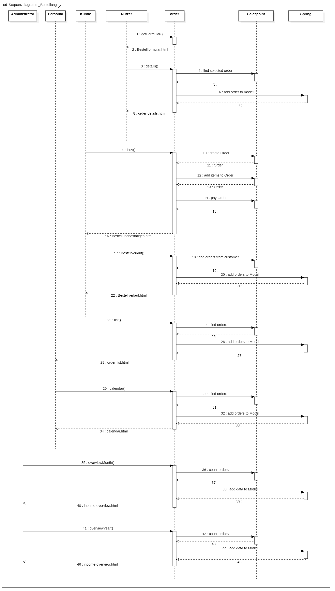

[options="header"]
[cols="1, 1, 1, 1, 4"]
|===
|Version | Status      | Bearbeitungsdatum   | Autoren |  Vermerk
|0.1     | In Arbeit   | 12.11.2021          | Dan Nguyen, Konrad Schneider, Lennart Obermüller, Lisa-Marie Müller, Mohamad Alibrahim, Rosa Splittgerber
| Alle Inhalte von der Entwicklerdokumentation wurden gemeinsam in der Gruppe erarbeitet und in einem Google-Document zusammengestellt. Ein Mitglied, dass einige Inhalte auf GitHub hochlädt, repräsentiert nicht unbedingt den Hauptautor dieser Inhalte.
|===

:numbered:

= Entwicklerdokumentation

== Inhaltsverzeichnis
<<Einführung und Ziele>> + 
<<Randbedingungen>> + 
<<Kontextabgrenzung>> +
<<Lösungsstrategie>> + 
<<Bausteinsicht>> + 
<<Laufzeitsicht (Bestellung)>> + 
<<Technische Schulden>>

== Einführung und Ziele
=== Aufgabenstellung:
Ein altes deutsches Sprichwort besagt: „Essen und Trinken hält Leib und Seele zusammen“. Das ist auch das Motto von Hannes Wurst, der seinen einst kleinen Imbissstand zu einem renommierte Cateringservice Mampf mit vielen Angestellten ausgebaut hat. Das Ziel dieser Software ist es, alle Abrechnungs-, Bestell- und Verwaltungsaufgaben zusammenzuführen und somit zu erleichtern.

Der Cateringservice Mampf bietet verschiedenen Nutzern unterschiedliche Interaktionsmöglichkeiten. Jedem Besucher der Website ist es möglich die Angebote des Cateringservice inklusive aller Details und Preise einzusehen. Es wird zwischen den Produkten _Eventcatering_, _Partyservice_, _Mobile Breakfast_ und _Rent-a-Cook_ unterschieden. Die verschiedenen Ressourcen _(Optiontype)_ werden im Inventar _(Inventory)_ mit ihrer verfügbaren Quantität _(Quantity)_ gespeichert. Wenn eine Bestellung aufgegeben wird, wird die Anzahl der verfügbaren Ressourcen im Inventar entsprechend angepasst.

Wenn ein Nutzer sich für ein Angebot entschieden hat, muss er sich zunächst registrieren _(register)_ um eine Bestellung aufgeben zu können. Um dabei Sicherheit zu garantieren, muss sich jeder Nutzer mit einem Namen _(name)_, einer E-Mail _(email)_ und einem Passwort _(password)_ registrieren, wobei die verwendete E-Mail einzigartig sein muss. Der angemeldete Nutzer _(Customer)_ kann nun im Bestellformular alle gewünschten Details angeben. Bestätigt der Kunde seine Angaben durch “Kaufen” _(buy)_, wird eine neue Bestellung _(Order)_ registriert. Sie enthält alle ausgewählten Optionen _(OrderLine)_ inklusive Anzahl und Preis. Sollten nicht genügend Ressourcen im Inventar vorhanden sein, erhält der Administrator eine Benachrichtigung, mit einer Aufforderung das Inventar aufzufüllen und der Kunde erhält eine Nachricht, die seine Bestellung bestätigt. Sollte die fehlende Ressource vom Typ PERSONAL sein, wird die Bestellung abgebrochen und der Kunde wird gebeten einen anderen Termin auswählen.

Solange die Bestellung nicht abgeschlossen ist, wird ihr der Status _(OrderStatus)_ “aktiv” zugeschrieben. Sollte der Kunde seine Bestellung stornieren, so wird der Status auf “storniert” angepasst. Erst nachdem der Termin der Bestellung abgelaufen ist, wird sie als “abgeschlossen” markiert.
Neben den für alle Nutzer zugänglichen Funktionalitäten bietet das System für Personal _(Staff)_ und Administrator _(Admin)_ gesonderten Zugang, der die Verwaltung und das Management des Cateringservice erlaubt. Somit  kann der Administrator alle Bestellungen, Angebote und Ressourcen verwalten, sowie Kunden _(Kundenliste)_ und Mitarbeiter _(Personalliste)_ im Überblick behalten. Zusätzlich kann er in der Einkommensübersicht die monatlichen bzw. jährlichen Einnahmen, die Verteilung der bestellten Angebotstypen und die Anteile der aktiven, abgeschlossenen und stornierten Bestellungen einsehen.

Jede aufgegebene Bestellung wird  in der _Bestellliste_ und im _Kalender_ angezeigt. Diese sind nur durch Nutzer einsehbar, die mit einem Nutzeraccount _(UserAccount)_ angemeldet sind, dem sie Rolle STAFF oder ADMIN zugeordnet ist. Der Nutzerfreundlichkeit halber soll es jedem möglich sein, Bestelldetails einzusehen. Für den Kunden im Bestellverlauf, für Personal und Administrator über _Bestellliste/Kalender_. 
Um Sicherheit zu gewährleisten, hat jeder Mitarbeiter einen eigenen Account _(UserAccount)_ der vom Administrator erstellt wird _(register)_ und gegebenenfalls gelöscht werden kann.

Alles in allem wollen wir ein sicheres System, welches die Verwaltung aller Bestellungen, Ressourcen, Kunden und Mitarbeiter erlaubt. So soll der Bestellprozess, und alles damit Verbundene, organisiert werden können. Dabei setzen wir auf eine einfache, unmissverständliche Benutzeroberfläche, die den Kunden gerne bei Mampf bestellen lässt.

=== Qualitätsziele
* Die folgenden Beschreibungen sind abgeleitet von der _ISO/IEC 25010 Software Quality Model_.
* Wartbarkeit: Grad, der angibt, wie effektiv und effizient ein Produkt oder ein System modifiziert werden kann, um es zu verbessern, zu korrigieren oder an veränderte Umgebungsbedingungen und Anforderungen anzupassen.
* Bedienbarkeit: Grad, der angibt wie gut ein Produkt oder System von bestimmten Benutzern verwendet werden kann, um bestimmte Ziele mit Effektivität, Effizienz und Zufriedenheit in einem bestimmten Nutzungskontext zu erreichen.
* Sicherheit: Grad, der angibt wie gut ein Produkt oder System Informationen und Daten schützt, und dafür sorgt, dass Personen nur den Zugriff haben, der ihrer Berechtigungsstufe entspricht.
* Die folgende Tabelle  zeigt die zu erreichenden Qualitätsziele im System und ihre Priorität: 1 = Nicht wichtig … 5 = Am wichtigsten

[options="header"]
[cols="1,1,1,1,1,1,3]
|===
|Qualitätsziel|1|2|3|4|5
|Wartbarkeit|||x||
|Bedienbarkeit||||x|
|Sicherheit||||x|
|===

== Randbedingungen
=== Hardware-Vorgaben
* Server
* Computer
* Tastatur
* Maus

=== Software-Vorgaben
* Die folgende Java Version ist zum Ausführen der Anwendung erforderlich:
** Java 11
* Die folgenden Browser sind notwendig, um die Anwendung zu nutzen:
** Google Chrome
** Mozilla Firefox

=== Vorgaben zum Betrieb der Software
* Die Software wird als Website vom Cateringservice Mampf betrieben, um ihre verschiedenen Angebote (...) an Privatpersonen und Firmen zu vermieten. Sie soll über einen Server laufen und im Internetbrowser für Kunden zur verfügung stehen.
* Die Hauptnutzer der Software sind private Haushalte und Firmen (customers), die sich grundlegend mit der Navigation von Webseiten auskennen, sowie Personal und Administrator, welche ebenfalls nur grundlegendes technisches Vorwissen besitzen.
* Das System soll ohne technische Wartung auskommen.

== Kontextabgrenzung

== Lösungsstrategie
=== Erfüllung der Qualitätsziele
[options="header"]
|=== 
|*Qualitätsziel* |*Lösungsansatz*
|*Wartbarkeit* | -*Modularität:* Sicherstellen, dass die Anwendung aus einzelnen Komponenten besteht, sodass Änderungen an einer Komponente weniger Auswirkungen auf andere haben + 
-*Wiederverwendbarkeit:* Sicherstellen, dass Komponenten des Systems von anderen Komponenten wiederverwendet +
-*Modifizierbarkeit:* Sicherstellen, dass die Anwendung verändert oder erweitert werden kann, ohne die Produktqualität zu beeinträchtigen
|*Bedienbarkeit* | -*Lernfähigkeit:* Sicherstellen, dass das System von den Nutzern einfach verstanden und genutzt werden kann +
-> Umsetzbar durch eindeutig und unmissverständlich beschriftete Menüpunkte und Buttons + 
-*Fehlerbehandlung:* Sicherstellen, dass fehlerhafte Eingaben von Nutzern nicht zu ungültigen Systemzuständen führen +
-*Barrierefreiheit:* Sicherstellen, dass Menschen mit verschiedensten Eigenschaften und Fähigkeiten in der Lage sind die Website zu nutzen +
-> Umsetzbar durch Verwendung von passenden Schriftgrößen und ordentlicher Nutzung von Schrift- und Hintergrundfarbe
|*Sicherheit* | -*Vertraulichkeit:* Sicherstellen, dass Leute nur zugriff auf die Informationen haben, zu denen sie eine Berechtigung haben. +
-> Umsetzbar mit _Spring Security und Thymeleaf_ (sec:authorize) + 
-*Integrität:* Sicherstellen, dass keine unbefugten Änderungen an Daten vorgenommen werden können + 
-> (@PreAuthorize - annotation) +
-*Verantwortlichkeit:* Rückverfolgung von Aktionen zu eindeutiger Person/ Rolle
|===

=== Softwarearchitektur
==== Top-Level-Architektur

==== Client-Server-Modell

=== Entwurfsentscheidungen
==== Verwendete Muster
* Spring MVC

==== Persistenz 
* Die Anwendung verwendet ein auf Hibernate-Annotationen basierendes Mapping, um Java-Klassen auf Datenbanktabellen abzubilden. Es wird eine H2 Datenbank benutzt, mit standardmäßig deaktivierter Persistenz. Um persistenten Speicher in der Datenbank zu aktivieren, müssen folgende zwei Zeilen in der Datei “application.properties” einkommentiert werden:
** # spring.datasource.url=jdbc:h2:./db/catering
** # spring.jpa.hibernate.ddl-auto=update

==== Benutzeroberfläche

=== Verwendung externer Frameworks

[options="header"]
|===
|*Externes Package* |*Verwendet von (Klasse der eigenen Anwendung)*
|salespointframework.catalog |-order.OrderController +
-catalog.Option + 
-catalog.OptionCatalog
|salespointframework.core| -catalog.CatalogDataInitializer + 
-nutzer.NutzerDataInitializer +
-catering.nutzer.Nutzer +
-inventory.InventoryDataInitializer +
-nutzer.KontoManagement
|salespointframework.inventory | -inventory.InventoryController +
-inventory.InventoryDataInitializer + 
-inventory.QuantityInputs
|salespointframework.order| -order.OrderController
|salespointframework.payment| -order.OrderController
|salespointframework.quantity| -order.OrderController + 
-catalog.CatalogController +
-inventory.InventoryDataInitializer
|salespointframework.SalespointSecurityConfiguration|-catering.Catering
|salespointframework.time| -catalog.CatalogController
|salespointframework.useraccount | -nutzer.Nutzer +
-nutzer.NutzerDataInitializer + 
-nutzer.KontoManagement
|salespointframework.boot | -catering.Catering +
-nutzer.Nutzer
|salespointframework.data | -nutzerKontoManagement +
-catalog.OptionCatalog +
-nutzer.NutzerRepository + 
-inventory.InventoryController
|salespointframework.security | -catering.Catering +
-nutzer.NutzerKontroller
|salespointframework.ui |-nutzer.NutzerKontroller +
-inventory.InventoryController
|salespointframework.util | -nutzer.NutzerKontroller +
-nutzer.NutzerDataInitializer + 
-order.OrderController + 
-catalog.CatalogDataInitializer + 
-inventory.InventoryDataInnitializer
|salespointframework..validation | -nutzer.NutzerKontroller
|salespointframework.web | -inventory.InventoryController + 
-nutzer.NutzerKontroller
|===

== Bausteinsicht
=== Catering

[options="header"]
|=== 
|*Klasse/Enumeration* |*Beschreibung*
|Catering|Die zentrale Klasse, welche die Anwendung startet und Konfigurationen für Spring vornimmt.
|WebSecurityConfiguration | Konfigurationsklasse, welche grundlegende Sicherheits- und An- und Abmeldeeinstellungen vornimmt.
|===

=== Katalog 

[options="header"]
|===
|*Klasse/Enumeration* |*Beschreibung*
|Option|Ein Produkt des Caterinservice.
|Optiontype|Der Typ einer Option, welcher GUETER, AUSRUESTUNG, PERSONAL oder ESSEN sein kann.
|OptionCatalog|Eine Erweiterung von Salespoint.Catalog, um nach Typ einer Option suchen zu können.
|CatalogDataInitializer|Eine Implementation von DataInizializer, der die Produkte und deren Ursprüngliche Preise festlegt.
|CatalogController|Ein Spring MVC Controller, der Anfragen auf Start-, Angebots- und Detailseiten verarbeiten kann.
|===

=== Nutzer

[options="header"]
|===
|*Klasse/Enumeration* |*Beschreibung*
|Nutzer|stellt angemeldeten Nutzer dar, der eine der Rollen “CUSTOMER”, “STAFF” oder “ADMIN” hat.
|NutzerKontroller|leitet Nutzeranfragen zu den zuständigen Klassen weiter.
|KontoManagement|stellt Funktionen zum Erstellen und Modifizieren von Nutzerkonten.
|Kontodata|Dataobject zum Austausch von Kontodaten.
|NutzerDataInitialisierer|implementiert DataInitializer zum Instanziieren von Nutzerkonten.
|NutzerRepository|Ein Repository-Interface, um Nutzer zu verwalten.
|===

=== Inventar 

[options="header"]
|===
|*Klasse/Enumeration* |*Beschreibung*
|InventoryDataInitializer|Eine Implementation von DataInitializer, der die anfänglichen Lagerbestände festlegt.
|InventoryController|Ein Spring MVC Controller, der Anfragen zum Einsehen und Bearbeiten des Inventars verarbeitet.
|QuantityInputs|Eine Wrapper-Klasse, um Daten an das html Dokument zu übermitteln.
|===

=== Bestellung 

[options="header"]
|===
|*Klasse/Enumeration* |*Beschreibung*
|OrderController|Ein Spring MVC Controller, der Anfragen zum Kaufen, und zum Anzeigen von Bestellliste, Kalender und Einkommensübersicht verarbeitet.
|===

=== Rückverfolgbarkeit zwischen Analyse- und Entwurfsmodell
_Die folgende Tabelle zeigt die Rückverfolgbarkeit zwischen Entwurfs- und Analysemodell. Falls eine Klasse aus einem externen Framework im Entwurfsmodell eine Klasse des Analysemodells ersetzt,
wird die Art der Verwendung dieser externen Klasse in der Spalte *Art der Verwendung* mithilfe der folgenden Begriffe definiert:_

* Vererbungsklasse/Interface-Implementation 
* Klassenattribut
* Funktionsargument

[options="header"]
|===
|Klasse/Enumeration (Analysemodell) |Klasse/Enumeration (Entwurfsmodell) |Art der Verwendung
|Catering|catering.Catering|
|Nutzer|Salespoint.UserAccount + 
catering.nutzer|
|Katalog|Salespoint.catalog|
|Inventar|Salespoint.UniqueInventory|
|Bestellliste| Salespoint.OrderManager<Order> |Klasseneigenschaft +
Funktionsargument
|Bestellung| Salespoint.Order|Funktionsargument
|Status| Salespoint.OrderStatus|Funktionsargument
|Rollen|Salespoint.Role|Funktionsargument
|Eventcatering, Partyservice, RentACook oder MobileBreakfast|catering.catalog.Option|Vererbungsklasse
|InventarItem| Salespoint.UniqueInventory|Funktionsargument
|Bestellungsinhalt|Salespoint.Orderline (via Salespoint.Order) | Klasseneigenschaft +
Funktionsargument
|KundenManagement| Salespoint.UserAccountManager + 
spring.CrudRepository + 
catering.Kunde + 
catering.Registrierungsform| Klasseneigenschaft + 
Klasseneigenschaft + 
Funktionsrückgabewert + 
Funktionsargument
|===

== Laufzeitsicht (Bestellung)

== Technische Schulden
* Auflistung der nicht erreichten Quality Gates und der zugehörigen SonarQube Issues zum Zeitpunkt der Abgabe

