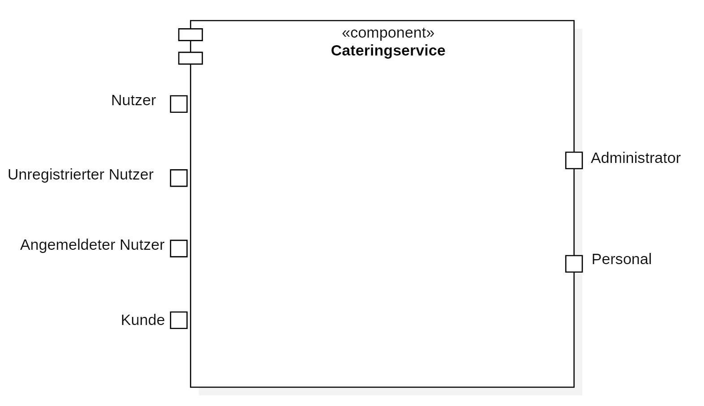
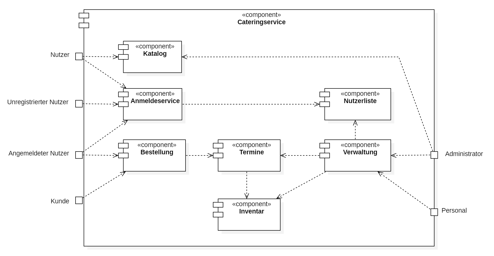
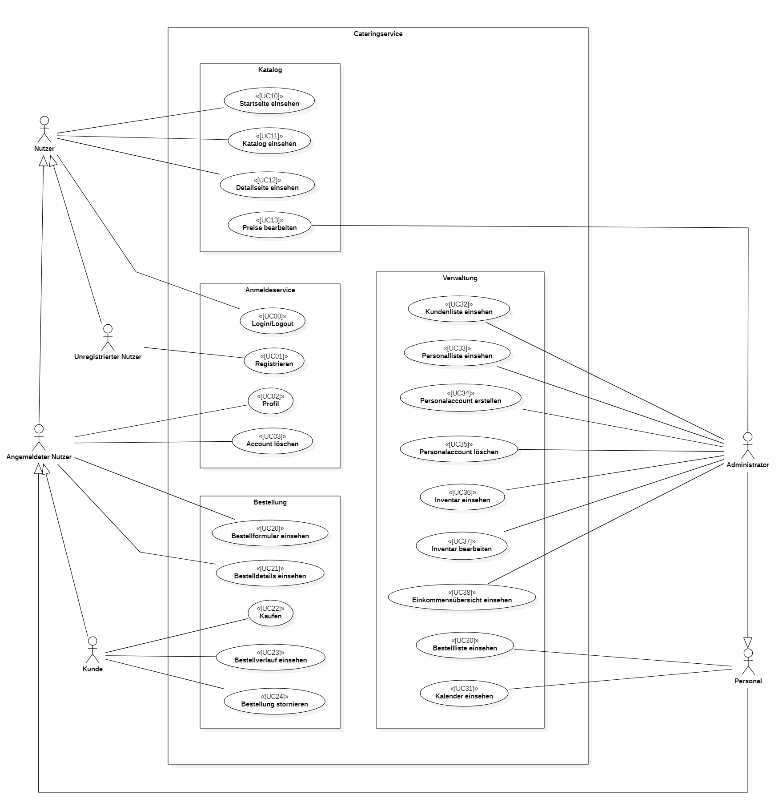
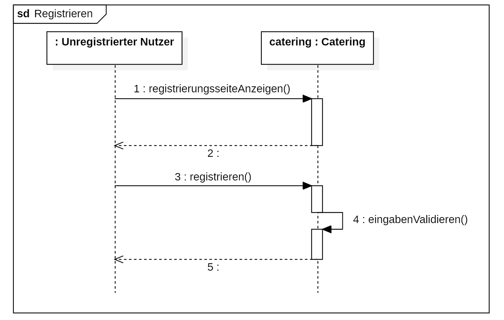
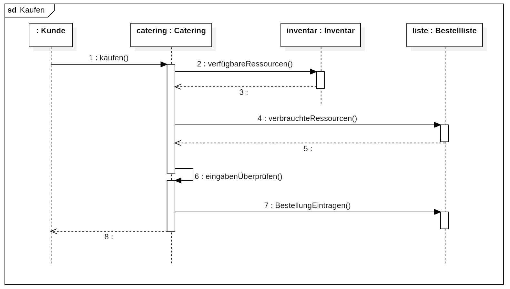
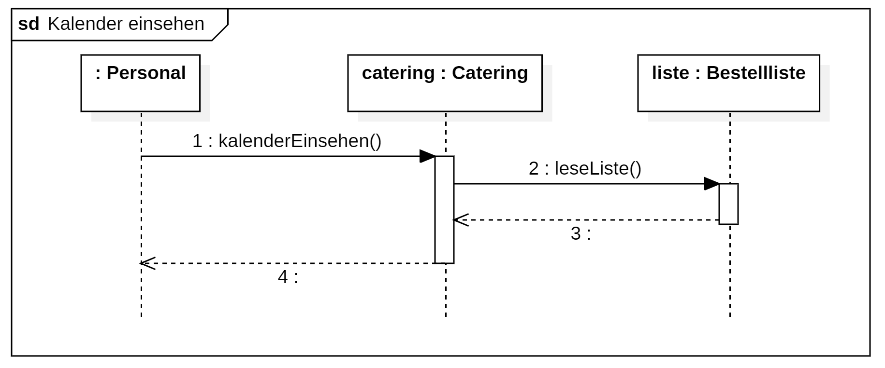
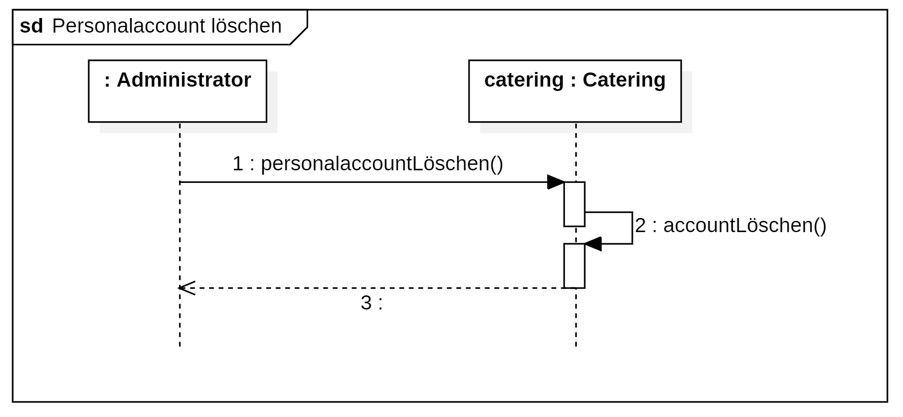
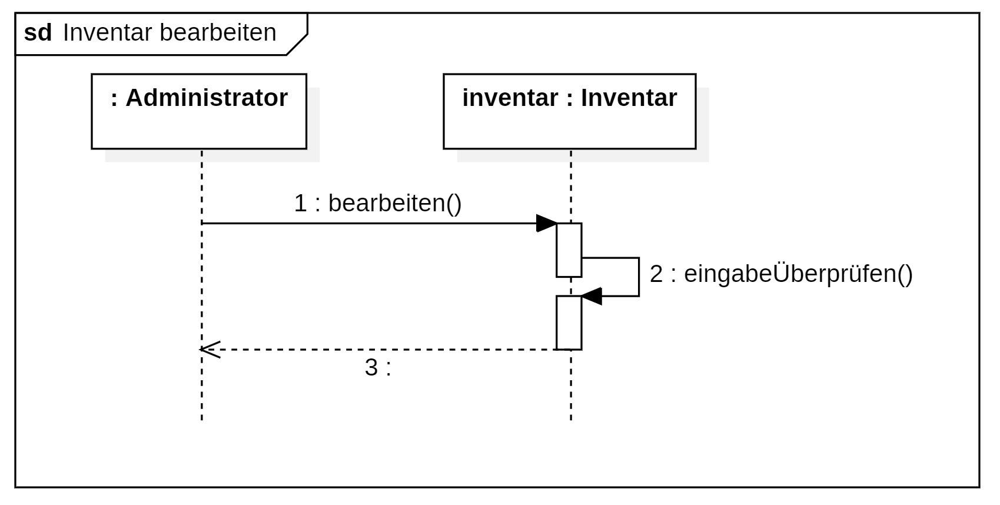
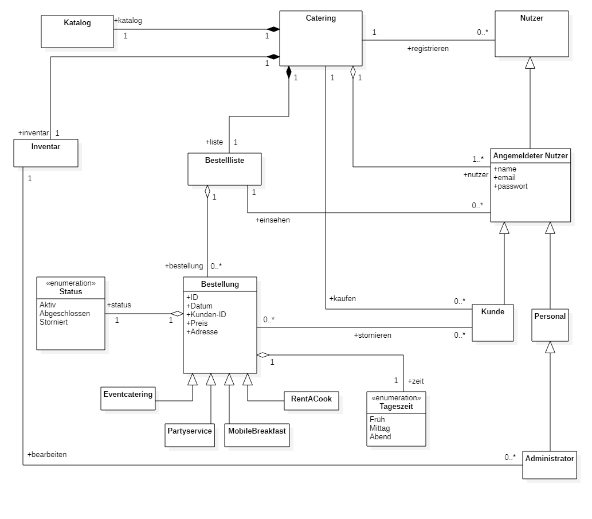

= Pflichtenheft
:project_name: Projektname
== __{project_name}__

[options="header"]
[cols="1, 1, 1, 1, 4"]
|===
|Version | Status      | Bearbeitungsdatum   | Autoren |  Vermerk
|0.1     | In Arbeit   | 28.10.2021          | Dan Nguyen, Konrad Schneider, Lennart Obermüller, Lisa-Marie Müller, Mohamad Alibrahim, Rosa Splittgerber
| Alle Inhalte vom Pflichtenheft wurden gemeinsam in der Gruppe erarbeitet und in einem Google-Document zusammengestellt. Ein Mitglied, dass einige Inhalte auf GitHub hochlädt, repräsentiert nicht unbedingt den Hauptautor dieser Inhalte.
|===

== Inhaltsverzeichnis

<<Zusammenfassung>> +
<<Aufgabenstellung und Zielsetzung>> +
<<Produktnutzung>> +
<<Interessensgruppen (Stakeholders)>> +
<<Systemgrenze und Top-Level-Architektur>> +
<<Anwendungsfälle>> +
<<Funktionale Anforderungen>> +
<<Nicht-Funktionale Anforderungen>> +
<<GUI Prototyp>> +
<<Datenmodell>> +
<<Akzeptanztestfälle>> +
<<Glossar>> +

== Zusammenfassung
Dieses Dokument gibt einen Überblick über die Spezifikation des zu implementierenden Systems _“Mampf ”_, die Anforderungen, die das System erfüllen muss und weitere Details wie z.B. GUI-Prototyp und Datenmodell.
Es stellt die Basis der Kommunikation zwischen dem Auftraggebers und Entwicklerteam und beschreibt *was* der Auftraggeber möchte, und *wie* das Entwicklerteam dieses realisiert dar.

== Aufgabenstellung und Zielsetzung
Der _Cateringservice_ _Mampf_ (Eigentümer Hannes Wurst) möchte seine Abrechnungs- Bestell und Verwaltungsaufgaben einheitlich in einer Software ausführen können. Der Cateringservice gliedert sich in vier Geschäftsfelder: Beim Eventcatering können Veranstalter ein Buffet oder Dinner mit Ausrüstung und Personal bestellen. Beim Partyservice können private Gastgeber kalten Platten bestellen. Das Mobile Breakfast können Firmen monatlich buchen, wobei ein Frühstücksangebot in der Firma serviert wird. Mit Rent-a-Cook können private Gastgeber Personal zum Zubereiten und Servieren von Essen buchen. Die Software soll die Kundenverwaltung unterstützen, die Personalverwaltung und -zuteilung übernehmen, die Termine planen, den Bedarf an Lebensmitteln und Zubehör bestimmen und die Rechnungsstellung an die Kunden vereinfachen.

== Produktnutzung
In welchem Kontext soll das System später genutzt werden? Welche Rahmenbedingungen gelten?
Zusätzlich kurze Einleitung für fachfremde Personen

Die Website des Cateringservice Mampf soll übersichtlich und informativ die unterschiedlichen Angebote der Firma an die Kunden bringen. Neben den gebotenen Informationen, soll es Kunden möglich sein, ein Event ohne großen Aufwand zu buchen. 
Bei der Zielgruppe handelt es sich sowohl um Firmen, die in der Lage sind, ohne große Probleme eine Website zu navigieren, als auch um Privatpersonen, die Feiern für verschiedene private Anlässe organisieren wollen, bei denen technisches Wissen nicht zwingend vorauszusetzen ist.

Die Website ist vor allem für die Nutzung am Computer vorgesehen und für folgende Browser optimiert: 

- Google Chrome, Version 95.0.4638.54+
- Mozilla Firefox, Version	93.0+

Die Software soll ohne Wartungsarbeiten konstant laufen und alle gespeicherten Daten sollen für den Betreiber ohne technisches Wissen über die Webseite abrufbar sein.

== Interessensgruppen (Stakeholders)
[options="header"]
[cols="5,5,5,5"]
|===
|*Name* | *Priorität*      | *Beschreibung*'   | *Ziele*
|_Cateringservice_ _Mampf_    | 5 | -Auftraggeber | -automatisieren -mehr verkaufen/höhere Effizienz +
-übersichtlicher
|Kunden (Firmen, Privatkunden) | 4 | -Hauptnutzer, sollen Geld einbringen | -übersichtlich +
-schnelles/einfaches buchen von Events
|Administrator(en) Herr Wurst | 2 | -kann alle Bestellungen und Termine sehen | -Einsicht in gesamtes System +
-Verwaltet alles
|Entwickler | 3 | -implementiert das System, Wartung, Erweiterungen | -geringer wartungsaufwand +
-einfach erweiterbar
| Personal | 1 | -Angestellte beim Cateringservice, kann Termine einsehen | -einfacher Zugriff und übersichtliche Ansicht auf alle Termine
|===

== Systemgrenze und Top-Level-Architektur

=== Kontextdiagramm
Das Kontextdiagramm zeigt das geplante Software-System in seiner Umgebung. Zur Umgebung gehören alle Nutzergruppen des Systems und Nachbarsysteme.

=== Top-Level-Architektur
Komponentendiagramm der Top-Level-Architektur des Systems.

== Anwendungsfälle

Anwendungsfälle beschreiben welche Interaktionen der Nutzer mit dem System durchführen kann, welche Funktionalität das System dabei erfüllen muss und welche Akteure beteiligt sind.

=== Akteure

Akteure sind die Benutzer des Software-Systems oder Nachbarsysteme, welche darauf zugreifen. Diese Tabelle gibt einen Überblick über die Akteure und beschreibt sie kurz.

// See http://asciidoctor.org/docs/user-manual/#tables
[options="header"]
[cols="1,4"]
|===
|Name
|Beschreibung

|Nutzer
|Steht für alle Nutzer, die mit der Software interagieren, egal ob registriert oder nicht.

|Unregistrierter Nutzer
|Steht für alle nicht registrierten und nicht angemeldeten Nutzer.

|Angemeldeter Nutzer
|Steht für alle Nutzer, die einen Account registriert haben, und angemeldet sind.

|Kunde
|Steht für alle angemeldeten Nutzer, die die Rolle “CUSTOMER” haben und somit Bestellungen tätigen können.

|Personal
|Steht für alle angemeldeten Nutzer, die die Rolle “STAFF” haben, und somit die eingegangenen Bestellungen einsehen können.

|Administrator
|Steht für alle angemeldeten Nutzer, die die Rolle “ADMIN” haben, und somit das System vollständig verwalten können.
|===

=== Überblick Anwendungsfalldiagramm
Anwendungsfall-Diagramm, das alle Anwendungsfälle und alle Akteure darstellt

=== Anwendungsfallbeschreibungen
Dieser Unterabschnitt gibt eine detaillierte Beschreibung aller Anwendungsfälle.

[cols="1h, 3"]
[[UC00]]
|===
|ID
|*<<UC00>>*

|Name
|Login/Logout

|Beschreibung
|Ein Nutzer soll in der Lage sein, sich auf der Website anzumelden, um Zugriff auf bestimmte Funktionalitäten zu erhalten. Am Ende kann sich der Nutzer wieder abmelden.

|Akteure
|Nutzer

|Auslöser
a|
- Login: Der Nutzer möchte erweiterten Zugriff erhalten und meldet sich über den “Anmelden”-Zugang an.
- Logout: Der Nutzer möchte die Seite wieder verlassen.

|Voraussetzungen
a|
- Login: Der Nutzer ist bereits registriert, ist jedoch noch nicht angemeldet.
- Logout: Der Nutzer ist angemeldet.

|Notwendige Schritte
a|
- Login: 
    1. Nutzer klickt auf “Anmelden”
    2. Er gibt E-Mail Adresse und Passwort ein
    3. Er klickt auf “Anmelden”
    4. Das System prüft, ob ein Nutzer mit der eingegebenen E-Mail Adresse und Passwort im System registriert ist
        * Anmeldedaten korrekt: Nutzer wird angemeldet
        * Anmeldedaten inkorrekt: Nutzer bekommt eine Fehlermeldung
- Logout:
    1. Nutzer klickt auf “Abmelden”
    2. Er wird abgemeldet und auf die Startseite geleitet

|Funktionale Anforderungen
|<<F010>>
|===

[cols="1h, 3"]
[[UC01]]
|===
|ID
|*<<UC01>>*

|Name
|Registrieren

|Beschreibung
|Ein Nutzer, der noch keinen Account besitzt, kann sich registrieren und einen neuen Account anlegen.

|Akteure
|Unregistrierter Nutzer

|Auslöser
|Unregistrierter Nutzer möchte einen neuen Account anlegen und klickt auf “Registrieren”

|Voraussetzungen
a|
- Nutzer ist nicht angemeldet

|Notwendige Schritte
a|
1. Unregistrierter Nutzer klickt auf den Menüpunkt “Registrieren”
2. Er gibt Name, E-Mail Adresse und Passwort an
3. Er klickt auf “Registrieren”
4. System prüft, ob die E-Mail Adresse schon von einem anderen Nutzer benutzt wurde und ob das Passwort minimalen Sicherheitsanforderungen entspricht
    * Wenn die E-Mail Adresse nicht bereits vorhanden und das Passwort sicher genug ist: ein neuer Account wird angelegt
    * Ansonsten: Nutzer bekommt Fehlermeldung entsprechend des nichterfüllten Kriteriums

|Funktionale Anforderungen
|<<F020>>, <<F030>>
|===

[cols="1h, 3"]
[[UC02]]
|===
|ID
|*<<UC02>>*

|Name
|Profil

|Beschreibung
|Ein angemeldeter Nutzer kann seine bei der Registrierung eingegebenen Daten einsehen und bearbeiten.

|Akteure
|Angemeldeter Nutzer

|Auslöser
|Angemeldeter Nutzer möchte sein Profil einsehen oder bearbeiten und klickt auf den Menüpunkt “Profil”

|Voraussetzungen
a|
- Nutzer ist angemeldet

|Notwendige Schritte
a|
1. Angemeldeter Nutzer klickt auf den Menüpunkt “Profil” und kann seinen Namen und E-Mail-Adresse einsehen
2. Er klickt auf “Profil bearbeiten”
3. Er kann neuen Name, neue E-Mail Adresse oder neues Passwort eingeben.
4. Er klickt auf “Bestätigen”
5. System prüft, ob die neue E-Mail Adresse schon von einem anderen Nutzer benutzt wurde und ob das Passwort minimalen Sicherheitsanforderungen entspricht
    * Wenn die E-Mail Adresse nicht bereits vorhanden und das Passwort sicher genug ist: die Daten werden im Account des Nutzers geändert
    * Ansonsten: Nutzer bekommt Fehlermeldung entsprechend des nichterfüllten Kriteriums

|Funktionale Anforderungen
|<<F010>>
|===

[cols="1h, 3"]
[[UC03]]
|===
|ID
|*<<UC03>>*

|Name
|Account löschen

|Beschreibung
|Ein angemeldeter Nutzer kann seinen Account löschen.

|Akteure
|Angemeldeter Nutzer

|Auslöser
|Angemeldeter Nutzer möchte seinen Account löschen und klickt auf “Account löschen”

|Voraussetzungen
a|
- Nutzer ist angemeldet
- Nutzer befindet sich auf der Seite

|Notwendige Schritte
a|
1. Angemeldeter Nutzer klickt auf “Account löschen”
2. Der Nutzer wird abgemeldet
3. Der Account des Nutzers wird aus dem System gelöscht

|Funktionale Anforderungen
|<<F010>>, <<F040>>
|===

[cols="1h, 3"]
[[UC10]]
|===
|ID
|*<<UC10>>*

|Name
|Startseite einsehen

|Beschreibung
|Dem Nutzer wird eine übersichtliche Seite mit allen Menüpunkten und einer kurzen Beschreibung des Unternehmens Cateringservice _Mampf_ angezeigt.

|Akteure
|Nutzer

|Auslöser
|Nutzer ruft die Internetseite des Cateringservice _Mampf_ auf, oder er möchte von einer Unterseite, durch Klicken auf “Cateringservice Mampf” im obersten Bereich jeder Seite, wieder zurück auf die Startseite gehen

|Voraussetzungen
a|keine

|Notwendige Schritte
a|
1. Nutzer ruft die Internetseite auf
  _oder_
  Nutzer klickt auf “Cateringservice Mampf” im obersten Bereich jeder Unterseite
2. Dem Nutzer wird die Startseite angezeigt

|Funktionale Anforderungen
|<<F130>>
|===

[cols="1h, 3"]
[[UC11]]
|===
|ID
|*<<UC11>>*

|Name
|Katalog einsehen

|Beschreibung
|Dem Nutzer werden die vier Dienstleistungen “Eventcatering”, “Partyservice”, “Mobile Breakfast” und “Rent-a-Cook” mit kurzen Beschreibungen aufgelistet.

|Akteure
|Nutzer

|Auslöser
|Nutzer möchte, durch Klicken auf den Menüpunkt “Angebot”, das Angebot des Cateringservice einsehen

|Voraussetzungen
a|keine

|Notwendige Schritte
a|
1. Nutzer klickt auf den Menüpunkt “Angebot”
2. Dem Nutzer werden alle angebotenen Dienstleistungen mit einer kurzen Beschreibung angezeigt

|Funktionale Anforderungen
|<<F140>>
|===

[cols="1h, 3"]
[[UC12]]
|===
|ID
|*<<UC12>>*

|Name
|Detailseite einsehen

|Beschreibung
|Dem Nutzer werden Bilder und eine detaillierte Beschreibung von jeweils einem der vier Dienstleistungen “Eventcatering”, “Partyservice”, “Mobile Breakfast” und “Rent-a-cook” angezeigt.

|Akteure
|Nutzer

|Auslöser
|Nutzer klickt auf eine der vier Dienstleistungen, um eine detaillierte Beschreibung zu sehen.

|Voraussetzungen
a|
- Nutzer befindet sich auf der Seite “Angebot”

|Notwendige Schritte
a|
1. Nutzer klickt auf die Bezeichnung von einer der vier Dienstleistungen “Eventcatering”, “Partyservice”, “Mobile Breakfast” und “Rent-a-cook”
2. Dem Nutzer werden Bilder und eine detaillierte Beschreibung der ausgewählten Dienstleistung angezeigt

|Funktionale Anforderungen
|<<F150>>
|===

[cols="1h, 3"]
[[UC13]]
|===
|ID
|*<<UC13>>*

|Name
|Preise bearbeiten

|Beschreibung
|Der Administrator kann die Preise der angebotenen Produkte ändern.

|Akteure
|Administrator

|Auslöser
|Administrator möchte die Preise der Produkte ändern

|Voraussetzungen
a|
- Nutzer ist angemeldet und hat die Rolle “ADMIN”
- Nutzer befindet sich auf der Detailseite einer Dienstleistung

|Notwendige Schritte
a|
1. Administrator klickt auf “Preise bearbeiten”
2. Er gibt neue Preise ein
3. Er klickt auf “Bestätigen”
4. Das System prüft die Eingabe
    * Gültige Eingabe: Die Preise im Katalog werden geändert
    * Ungültige Eingabe: Dem Administrator wird eine Fehlermeldung angezeigt

|Funktionale Anforderungen
|<<F540>>, <<F160>>, <<F140>>
|===

[cols="1h, 3"]
[[UC20]]
|===
|ID
|*<<UC20>>*

|Name
|Bestellformular einsehen

|Beschreibung
|Ein angemeldeter Nutzer entscheidet sich für eine Dienstleistung und kann ein Formular mit allen nötigen Optionen für die Bestellung einsehen.

|Akteure
|Angemeldeter Nutzer

|Auslöser
|Angemeldeter Nutzer ruft die Formularseite auf, um Bestelldetails einzugeben

|Voraussetzungen
a|
- Nutzer ist angemeldet
- Nutzer befindet sich auf der Detailseite einer Dienstleistung

|Notwendige Schritte
a|
1. Angemeldeter Nutzer klickt auf “Bestellen” auf der Detailseite einer Dienstleistung
2. Dem angemeldeten Nutzer wird jeweils das Bestellformular zur ausgewählten Dienstleistung angezeigt

|Funktionale Anforderungen
|<<F160>>, <<F140>>
|===

[cols="1h, 3"]
[[UC21]]
|===
|ID
|*<<UC21>>*

|Name
|Bestelldetails einsehen

|Beschreibung
|Einem angemeldeten Nutzer werden sämtliche Details und Attribute einer Bestellung angezeigt.

|Akteure
|Angemeldeter Nutzer

|Auslöser
|Nutzer klickt auf den Typ (“Eventcatering”, “Partyservice”, “Mobile Breakfast”, “Rent-a-Cook”) einer Bestellung

|Voraussetzungen
a|
- Nutzer ist angemeldet und hat die Rolle “CUSTOMER”
- Nutzer befindet sich auf der Seite
“Bestellverlauf”

_oder_

- Nutzer ist angemeldet und hat die Rolle “STAFF”
- Nutzer befindet sich auf der Seite
    “Bestellliste”
    _oder_
    “Kalender”

|Notwendige Schritte
a|
1. Angemeldeter Nutzer klickt auf den Typ einer Bestellung
2. Dem Nutzer werden alle Details zur gewählten Bestellung angezeigt

|Funktionale Anforderungen
|<<F330>>, <<F300>>
|===

[cols="1h, 3"]
[[UC22]]
|===
|ID
|*<<UC22>>*

|Name
|Kaufen

|Beschreibung
|Ein Kunde kann eine Bestellung tätigen.

|Akteure
|Kunde

|Auslöser
|Kunde klickt auf “Kaufen”

|Voraussetzungen
a|
- Nutzer ist angemeldet und hat die Rolle “CUSTOMER”
- Nutzer befindet auf der Formularseite einer Dienstleistung

|Notwendige Schritte
a|
1. Kunde gibt alle gewünschten Optionen an
2. Er klickt auf “Kaufen”
3. System prüft, ob alle Felder korrekt ausgefüllt wurden und ob zum gewählten Termin noch genügend Ressourcen verfügbar sind
    * Alle Felder sind korrekt ausgefüllt und es sind genügend Ressourcen verfügbar: die Bestellung wird mit dem Status “Aktiv” im System eingetragen und dem Kunden wird eine Bestätigungs-E-Mail geschickt
    * Alle Felder sind korrekt ausgefüllt und es sind zu wenig Verbrauchsgüter oder Ausrüstung verfügbar: die Bestellung wird mit dem Status ‘Aktiv’ im System eingetragen, dem Kunden wird eine Bestätigungs-E-Mail geschickt und dem Administrator wird eine Informations-E-Mail zum Auffüllen der Bestände geschickt
    * Alle Felder sind korrekt ausgefüllt und es ist zu wenig Personal verfügbar: Kunde bekommt eine Fehlermeldung, dass der Cateringservice zum gewählten Termin schon voll ausgelastet ist und dem Administrator wird eine Informations-E-Mail geschickt, dass eine Bestellung mangels Personal abgelehnt wurde
    * Es wurden nicht alle Felder korrekt ausgefüllt oder der gewählte Termin liegt weniger als drei Tage im Voraus: Kunde bekommt eine entsprechende Fehlermeldung

|Funktionale Anforderungen
|<<F200>>, <<F210>>, <<F310>>, <<F100>>, <<F120>>, <<F300>>, <<F160>>
|===

[cols="1h, 3"]
[[UC23]]
|===
|ID
|*<<UC23>>*

|Name
|Bestellverlauf einsehen

|Beschreibung
|Einem Kunden kann eine Liste mit all seinen bereits getätigten Bestellungen angezeigt werden.

|Akteure
|Kunde

|Auslöser
|Kunde möchte seine Bestellverlauf einsehen und klickt auf den Menüpunkt “Bestellverlauf”

|Voraussetzungen
a|
- Nutzer ist angemeldet und hat die Rolle “CUSTOMER”

|Notwendige Schritte
a|
1. Kunde klickt auf den Menüpunkt “Bestellverlauf”
2. Dem Nutzer wird eine Liste seiner Bestellungen mit Typ, Termin und Status angezeigt

|Funktionale Anforderungen
|<<F320>>, <<F310>>, <<F300>>, <<F210>>
|===

[cols="1h, 3"]
[[UC24]]
|===
|ID
|*<<UC24>>*

|Name
|Bestellung stornieren

|Beschreibung
|Ein Kunde kann eine von ihm getätigte Bestellung mit dem Status “Aktiv” stornieren.

|Akteure
|Kunde

|Auslöser
|Kunde klickt auf “Stornieren” neben einer Bestellung

|Voraussetzungen
a|
- Nutzer ist angemeldet und hat die Rolle “CUSTOMER”
- Nutzer befindet sich auf der Seite “Bestellverlauf”

|Notwendige Schritte
a|
1. Kunde klickt auf “Stornieren”
2. Der Status der ausgewählten Bestellung wird von “Aktiv” auf “Storniert” gesetzt
3. Dem Kunden wird eine Bestätigungs-E-Mail geschickt

|Funktionale Anforderungen
|<<F340>>, <<F300>>, <<F210>>
|===

[cols="1h, 3"]
[[UC30]]
|===
|ID
|*<<UC30>>*

|Name
|Bestellliste einsehen

|Beschreibung
|Dem Personal kann eine Liste aller eingegangenen Bestellungen angezeigt werden. Es kann nach Status der Bestellung gefiltert werden.

|Akteure
|Personal

|Auslöser
|Personal möchte die Bestellliste einsehen und klickt auf den Menüpunkt “Bestellliste”

|Voraussetzungen
a|
- Nutzer ist angemeldet und hat die Rolle “STAFF”

|Notwendige Schritte
a|
1. Personal klickt auf den Menüpunkt “Bestellliste”
2. Dem Personal wird eine Liste mit eingegangenen Bestellungen angezeigt

|Funktionale Anforderungen
|<<F310>>, <<F300>>, <<F210>>
|===

[cols="1h, 3"]
[[UC31]]
|===
|ID
|*<<UC31>>*

|Name
|Kalender einsehen

|Beschreibung
|Dem Personal können alle eingegangenen Bestellungen mit dem Status “Aktiv” in einem Kalender angezeigt werden.

|Akteure
|Personal

|Auslöser
|Personal möchte den Kalender einsehen und klickt auf den Menüpunkt “Kalender”

|Voraussetzungen
a|
- Nutzer ist angemeldet und hat die Rolle “STAFF”

|Notwendige Schritte
a|
1. Personal klickt auf den Menüpunkt “Kalender”
2. Dem Personal werden aktive Bestellungen in Form eines Kalenders angezeigt

|Funktionale Anforderungen
|<<F400>>, <<F300>>, <<F310>>
|===

[cols="1h, 3"]
[[UC32]]
|===
|ID
|*<<UC32>>*

|Name
|Kundenliste einsehen

|Beschreibung
|Der Administrator kann eine Liste aller registrierten Kunden mit ihren ID’s, Namen und E-Mail Adressen einsehen.

|Akteure
|Administrator

|Auslöser
|Administrator möchte die Kundenliste einsehen klickt auf den Menüpunkt “Kundenliste”

|Voraussetzungen
a|
- Nutzer ist angemeldet und hat die Rolle “ADMIN”

|Notwendige Schritte
a|
1. Administrator klickt auf den Menüpunkt “Kundenliste”
2. Dem Administrator wird eine Liste aller Kunden mit ID, Name und E-Mail Adresse angezeigt

|Funktionale Anforderungen
|<<F500>>
|===

[cols="1h, 3"]
[[UC33]]
|===
|ID
|*<<UC33>>*

|Name
|Personalliste einsehen

|Beschreibung
|Der Administrator kann eine Liste aller registrierten Nutzer mit der Rolle “STAFF” mit ihren ID’s, Namen und E-Mail Adressen einsehen.

|Akteure
|Administrator

|Auslöser
|Administrator möchte die Personalliste einsehen und klickt auf den Menüpunkt “Personalliste”

|Voraussetzungen
a|
- Nutzer ist angemeldet und hat die Rolle “ADMIN”

|Notwendige Schritte
a|
1. Administrator klickt auf den Menüpunkt “Personalliste”
2. Dem Administrator wird eine Liste aller Mitarbeiter mit ID, Name und E-Mail Adresse angezeigt

|Funktionale Anforderungen
|<<F510>>
|===

[cols="1h, 3"]
[[UC34]]
|===
|ID
|*<<UC34>>*

|Name
|Personalaccount erstellen

|Beschreibung
|Der Administrator kann einen neuen Account registrieren welcher die Rolle “STAFF” bekommt.

|Akteure
|Administrator

|Auslöser
|Administrator möchte einen neuen Personalaccount anlegen und klickt auf “Personalaccount erstellen”

|Voraussetzungen
a|
- Nutzer ist angemeldet und hat die Rolle “ADMIN”
- Nutzer befindet sich auf der Seite “Personalliste”

|Notwendige Schritte
a|
1. Administrator klickt auf “Personalaccount erstellen”
2. Er gibt Name, E-Mail Adresse und Passwort an
3. Er klickt auf “Registrieren”
4. System prüft, ob die E-Mail Adresse schon von einem anderen Nutzer benutzt wurde und ob das Passwort minimalen Sicherheitsanforderungen entspricht
    * Wenn die E-Mail Adresse nicht bereits vorhanden und das Passwort sicher genug ist: ein neuer Account wird angelegt und ihm wird die Rolle “STAFF” zugewiesen
    * Ansonsten: Administrator bekommt Fehlermeldung entsprechend des nichterfüllten Kriteriums

|Funktionale Anforderungen
|<<F530>>, <<F510>>
|===

[cols="1h, 3"]
[[UC35]]
|===
|ID
|*<<UC35>>*

|Name
|Personalaccount löschen

|Beschreibung
|Der Administrator kann einen Personalaccount löschen.

|Akteure
|Administrator

|Auslöser
|Administrator möchte einen Personalaccount löschen und klickt auf “Account löschen”

|Voraussetzungen
a|
- Nutzer ist angemeldet und hat die Rolle “ADMIN”
- Nutzer befindet sich auf der Seite “Personalliste”

|Notwendige Schritte
a|
1. Administrator klickt auf “Account löschen” neben einem Mitarbeiter in der Personalliste
2. Der Account des entsprechenden Mitarbeiters wird aus dem System gelöscht

|Funktionale Anforderungen
|<<F530>>, <<F510>>
|===

[cols="1h, 3"]
[[UC36]]
|===
|ID
|*<<UC36>>*

|Name
|Inventar einsehen

|Beschreibung
|Der Administrator kann eine Liste aller vorhandenen Verbrauchsgüter, Ausrüstung und Personal einsehen. 

|Akteure
|Administrator

|Auslöser
|Administrator möchte das Inventar einsehen und klickt auf den Menüpunkt “Inventar”

|Voraussetzungen
a|
- Nutzer ist angemeldet und hat die Rolle “ADMIN”

|Notwendige Schritte
a|
1. Administrator klickt auf den Menüpunkt “Inventar”
2. Dem Administrator wird eine Liste aller verfügbaren Ressourcen und Personal angezeigt

|Funktionale Anforderungen
|<<F100>>
|===

[cols="1h, 3"]
[[UC37]]
|===
|ID
|*<<UC37>>*

|Name
|Inventar bearbeiten

|Beschreibung
|Der Administrator kann Verbrauchsgüter zum Inventar hinzufügen und die Quantitäten der insgesamt verfügbaren Ausrüstung und Personal bearbeiten.

|Akteure
|Administrator

|Auslöser
|Administrator möchte die Quantitäten verfügbarer Ressourcen ändern

|Voraussetzungen
a|
- Nutzer ist angemeldet und hat die Rolle “ADMIN”
- Nutzer befindet sich auf der Seite “Inventar”

|Notwendige Schritte
a|
1. Administrator gibt ein, wie viel zu einer Ressource hinzugefügt bzw. abgezogen werden soll
2. Administrator klickt auf “Bestätigen”
3. Das System prüft die Eingabe
    * Gültige Eingabe: Die Quantitäten im Inventar werden geändert
    * Ungültige Eingabe: Dem Administrator wird eine Fehlermeldung angezeigt

|Funktionale Anforderungen
|<<F110>>
|===

[cols="1h, 3"]
[[UC38]]
|===
|ID
|*<<UC38>>*

|Name
|Einkommensübersicht einsehen

|Beschreibung
|Der Administrator kann eine Übersicht wichtiger Statistiken geordnet nach Jahren und Monaten sehen. Dies sind: insgesamt eingenommenes Geld, Anteil der Aktiven, Abgeschlossenen und Stornierten Bestellungen an der gesamten Anzahl eingegangener Bestellungen und Verteilung der vier Bestellungstypen.

|Akteure
|Administrator

|Auslöser
|Administrator möchte die Einkommensübersicht einsehen klickt auf den Menüpunkt “Einkommensübersicht”

|Voraussetzungen
a|
- Nutzer ist angemeldet und hat die Rolle “ADMIN”

|Notwendige Schritte
a|
1. Administrator klickt auf den Menüpunkt “Einkommensübersicht”
2. Dem Administrator wird eine Übersicht wichtiger Statistiken geordnet nach bzw. unterteilt in Jahre und Monate angezeigt

|Funktionale Anforderungen
|<<F550>>, <<F320>>, <<F300>>
|===

== Funktionale Anforderungen

Funktionale Anforderungen sind Anforderungen, die das System auf jeden Fall leisten muss.

[options="header", cols="2h, 1, 3, 12"]
|===
|ID
|Version
|Name
|Beschreibung

|[[F010]]<<F010>>
|v0.1
|Authentifizierung
a|Das System soll fähig sein bestimmte Funktionen in öffentliche und private einzuteilen. 
Falls ein Nutzer im System gespeichert wurde (registrierter Nutzer), soll er die Möglichkeit haben sich zu authentifizieren mit folgenden Angaben: E-Mail, Passwort

|[[F020]]<<F020>>
|v0.1
|Registrierung
a|Das System soll einen unregistrierten Nutzer die Möglichkeit geben, sich zu registrieren bei der Nutzung des Navigationselement namens “Registrieren”. 

Folgende Angaben sind zu geben: Name, E-Mail, Passwort. 

Das System soll die gegebenen Daten überprüfen und bestätigen, sowie abspeichern. Nach der Validierung kann sich der Nutzer anmelden

|[[F030]]<<F030>>
|v0.1
|Überprüfung
a|Das System soll fähig sein die gegebenen Daten von einem unregistrierten Nutzers zu überprüfen

Die Einzigartigkeit der E-Mail muss garantiert werden. Der Nutzer soll auf Beschränkungen und Verstöße hingewiesen werden

|[[F040]]<<F040>>
|v0.1
|Nutzerdaten überprüfen
a|Das System soll einem angemeldeten Nutzer die Möglichkeit geben, seine bereits gespeicherten Nutzerdaten zu überschreiben oder löschen

|[[F100]]<<F100>>
|v0.1
|Inventar
a|Das System soll andauernd die Daten der Ressourcen im Inventar aufbewahren

|[[F110]]<<F110>>
|v0.1
|Inventar anpassen
a|Das System soll dem Administrator erlauben den Inhalt des Inventars anpassen und diese zu überschreiben

|[[F120]]<<F120>>
|v0.1
|Verfügbarkeit von Ressourcen im Inventar ändern
a|Das System soll nach jeder validen erfolgreichen oder stornierten Bestellung die Verfügbarkeit der Ressourcen ändern

|[[F130]]<<F130>>
|v0.1
|Startseite
a|Das System soll beim aufrufen der Webseite, als erstes auf die Startseite (als Hauptseite) hinweisen.

Die Startseite besitzt ein Menü, neben der es eine kurze Beschreibung der Firma gibt

|[[F140]]<<F140>>
|v0.1
|Katalog
a|Das System soll eine Möglichkeit zur Darstellung der Angebote zur Verfügung stellen in Form eines Katalogs

|[[F150]]<<F150>>
|v0.1
|Detailseite
a|Das System soll eine detaillierte Einsicht der einzelnen Angebote zur Verfügung stellen

|[[F160]]<<F160>>
|v0.1
|Bestellformular
a|Das System stellt eine Ansicht zum auswählen und ausfüllen von Details in Form eines Bestellformulars zur Verfügung

|[[F200]]<<F200>>
|v0.1
|Kaufen
a|Das System soll einem angemeldeten Nutzer die Möglichkeit geben ein Angebot über das Bestellformular mit den aktuell ausgewählten Optionen zu kaufen

Vor dem Kauf muss die Bestellung überprüft werden. Eine Bestellung soll aufgegeben werden, wenn genug Ressourcen auf Lager sind

|[[F210]]<<F210>>
|v0.1
|Validierung der Bestellung
a|Das System überprüft,, ob für den angegebenen Termin noch genug Ressourcen (Personal, Ausrüstung, Deko) vorhanden sind um die Bestellung zu validieren. Falls die Bestellung validiert wurde, wird sie der Bestellliste hinzugefügt

Der Nutzer wird über Erfolg oder Fehlschlag der Validierung informiert

|[[F300]]<<F300>>
|v0.1
|Bestellungen
a|Das System soll fähig sein andauernd Details von Bestellungen zu speichern/lagern

|[[F310]]<<F310>>
|v0.1
|Bestellliste
a|Das System speichert alle erfolgreich validierten Bestellungen in der Bestellliste ab

|[[F320]]<<F320>>
|v0.1
|Bestellverlauf
a|Das System soll fähig sein einem angemeldeten Nutzer, alle von ihm aufgegebenen Bestellung/en (in Form einer Liste) anzuzeigen

|[[F330]]<<F330>>
|v0.1
|Bestelldetails
a|Das System soll beim Aufruf einer Bestellung im Bestellverlauf, dessen Details anzeigen

|[[F340]]<<F340>>
|v0.1
|Bestellung stornieren
a|Ein angemeldeter Nutzer kann die Bestellung 3 Tage im Voraus stornieren.

Innerhalb der 3 Tage wird dem angemeldeten Nutzer eine Stornierungsgebühr von 40% des Bestellungspreises angerechnet.

Bei einer erfolgreichen Stornierung werden die Daten der reservierten Ressourcen wieder an das Inventar zurückgegeben und abgespeichert

|[[F400]]<<F400>>
|v0.1
|Kalender einsehen
a|Das System soll alle aktiven Bestellungen abspeichern und in Form eines Kalenders darstellen

|[[F500]]<<F500>>
|v0.1
|Kundenliste anzeigen
a|Das System soll dem Administrator erlauben, durchs Klicken auf den entsprechenden Menüpunkt sich eine Liste aller aktuell registrierten Nutzer, die die Rolle “CUSTOMER” haben mit jeweiligem Name und E-Mail anzeigen zu lassen

|[[F510]]<<F510>>
|v0.1
|Personalliste anzeigen
a|Das System soll dem Administrator erlauben, durchs Klicken auf den entsprechenden Menüpunkt sich eine Liste aller aktuell registrierten Nutzer, die die Rolle “STAFF” haben mit jeweiligem Name und E-Mail anzeigen zu lassen

|[[F520]]<<F520>>
|v0.1
|Bestellliste anzeigen
a|Das System soll dem Administrator erlauben, durchs Klicken auf den entsprechenden Menüpunkt sich eine Liste aller Bestellungen mit den jeweiligen Attributen anzeigen lassen

|[[F530]]<<F530>>
|v0.1
|Konto für Mitarbeiter erstellen (löschen)
a|Der Administrator kann ein Konto für Mitarbeiter erstellen (gegebenenfalls löschen)

Diese erstellten Konten erhalten die Rolle “STAFF” und erhalten weitere Funktionen

|[[F540]]<<F540>>
|v0.1
|Preise anpassen
a|Das System gibt dem Administrator die Möglichkeit, die Preise im Katalog anzupassen

Das System überprüft ob die Eingab. Falls die Eingabe gültig ist wird der alte Preis überschrieben. Bei einer ungültigen Eingabe wird eine Fehlermeldung angezeigt

|[[F550]]<<F550>>
|v0.1
|Einkommensübersicht
a|Das System soll dem Administrator die Möglichkeit geben alle Umsätze, die durch Bestellungen hinzu kamen und ihm die Möglichkeit geben, diese auch einzusehen in einer geordneten Form oder Statistik

Hier gibt es verschiedene Auswahlmöglichkeiten für die Angebotsoptionen, eine Eingabemöglichkeit für die Anzahl der Personen und den Termin und eine dynamische Kostenberechnung.

|===

== Nicht-Funktionale Anforderungen
Dieses Kapitel gibt einen Überblick über die Nicht-Funktionalen Anforderungen. Diese beinhalten Qulitätsattribute, ohne die eine der Nutzergruppen benachteiligt wird.

=== Qualitätsziele

Die folgende Tabelle zeigt die zu erreichenden Qualitätsziele im System und ihre Priorität.

1 = Nicht wichtig ...
5 = Am wichtigsten

[options="header", cols="3h, ^1, ^1, ^1, ^1, ^1"]
|===
|Qualitätsziel           | 1 | 2 | 3 | 4 | 5 
|Wartbarkeit             |   | x |   |   |
|Bedienbarkeit           |   |   |   | x |
|Sicherheit              |   |   |   | x |
|===

=== Konkrete Nicht-Funktionale Anforderungen

Nicht-Funktionale Anforderungen dienen dazu, die zuvor definierten Qualitätsziele zu erreichen.

[options="header", cols="h, ^1, ^1, ^1"]
|===
|ID         |Version | Name          | Beschreibung
|[NF010]    |0.1     |Wartbarkeit    | Das System soll mit einer ausreichenden Developerdokumentation geliefert weden.
|[NF020]    |0.1     |Bedienbarkeit  | Die Benutzeroberflächen sollen pbersichtlich sein. Knöpfe und Forms sollen gut zusammengestellt und weisen eine einfache Bedienung aller Nutzergruppen aus
|[NF030]    |0.1     |Autorität     | Die Systemnutzer sollen nicht mehr Zugriffsrechte haben als die, die bei der Kontoerstellung angegeben wurden. Bei sehr großen Bestellungen soll dem Nutzer daraut hingewiesen werden, dass die Bestellung vor Ort abgeschlossen werden muss
|===

== GUI Prototyp

[[startseite_image]]
image::./Bilder/gui/startseite.PNG[Startseite, 100%, 100%, pdfwidth=100%, title= "Startseite des Cateringservice", align=center]

[[registrieren_image]]
image::./Bilder/gui/registrieren.PNG[Registrierungsseite, 100%, 100%, pdfwidth=100%, title= "Registrierungsseite des Cateringservice", align=center]

[[anmelden_image]]
image::./Bilder/gui/anmelden.png[Anmeldeseite des Cateringservice, 100%, 100%, pdfwidth=100%, title= "Anmeldeseite des Cateringservice", align=center]

[[angebot_image]]
image::./Bilder/gui/angebot.png[Angebotsseite, 100%, 100%, pdfwidth=100%, title= "Angebotsübersicht des Cateringservice", align=center]

== Datenmodell

=== Überblick: Klassendiagramm

=== Klassen und Enumerationen
Dieser Abschnitt stellt eine Vereinigung von Glossar und der Beschreibung von Klassen/Enumerationen dar. Jede Klasse und Enumeration wird in Form eines Glossars textuell beschrieben. Zusätzlich werden eventuellen Konsistenz- und Formatierungsregeln aufgeführt.

// See http://asciidoctor.org/docs/user-manual/#tables
[options="header" cols="2, 5"]
|===
|Klasse/Enumeration |Beschreibung
|Catering | Zentrale Klasse der Software, welche alle wichtigen Funktionen verknüpft und für den Cateringservice an sich steht.
|Nutzer | Repräsentation eines beliebigen realen Nutzers der Software, egal ob angemeldet oder nicht.
|Angemeldeter Nutzer | Repräsentation eines Nutzers, welcher einen Account registriert und sich angemeldet hat.
|Kunde | Repräsentation eines angemeldeten Nutzers, welcher sich als Kunde registriert hat.
|Personal | Repräsentation eines angemeldeten Nutzers, welcher vom Administrator als Mitarbeiter registriert wurde.
|Administrator | Repräsentation eines angemeldeten Nutzers, welcher als Administrator registriert ist.
|Katalog | Klasse, welche zum Anzeigen einiger Unterseiten zuständig ist.
|Inventar | Das Inventar speichert wie viele Verbrauchsgüter und Ausrüstung im Lager vorhanden sind und wie viel Personal gerade beschäftigt wird.
|Bestellliste | In der Bestellliste werden alle bereits eingegangenen Bestellungen mit allen zugehörigen Details gespeichert.
|Bestellung | Allgemeines Produkt des Cateringservice.
|Status | Der aktuelle Status einer Bestellung.
“Aktiv”: Kunde hat eine Bestellung getätigt und bezahlt.
“Abgeschlossen”: Der Termin einer aktiven Bestellung ist vorüber und die Dienstleistung wurde erbracht.
“Storniert”: Kunde hat eine aktive Bestellung vor dem Termin, an dem sie ausgeführt werden sollte, storniert.
|Tageszeit | Repräsentiert zu welcher Uhrzeit an einem bestimmten Datum die Bestellung ausgeführt werden soll.
Früh: 6:00 Uhr - 11:00 Uhr
Mittag: 11:00 Uhr - 17:00 Uhr
Abend: 17:00 Uhr - 00:00 Uhr
|Eventcatering, Partyservice, RentACook oder MobileBreakfast | Eine bestimmte Art von Bestellung, welche spezielle Bestelloptionen zur Verfügung stellt.

|===

== Akzeptanztestfälle
Mithilfe von Akzeptanztests wird geprüft, ob die Software die funktionalen Erwartungen und Anforderungen im Gebrauch erfüllt. Die folgende Tabelle listete alle Akzeptanztests auf, die erfüllt werden müssen, damit die Software die Anforderungen des Kunden erfüllt.

[cols="1h, 4"]
[[AT000]]
|===
|ID
|<<AT000>>

|Anwendungsfall
|<<UC00>>

|Voraussetzung
a|Ein unregistrierter Nutzer nutzt das System.

|Event
a|Der unregistrierte Nutzer klickt auf “Anmelden” in der Navigationsleite.

|Erwartetes Resultat
a|Der Nutzer wird auf die “Anmelden”-Seite geleitet
|===

[cols="1h, 4"]
[[AT001]]
|===
|ID
|<<AT001>>

|Anwendungsfall
|<<UC00>>

|Voraussetzung
a|
- Ein unregistrierter Nutzer befindet sich auf der “Anmelden”-Seite (<<AT000>>)
- Im System ist ein Nutzer mit E-Mail-Adresse "hannes.wurst@mampf.de" und Passwort "cAt3r1nG_yeay" eingetragen

|Event
a|
1. Der unregistrierte Nutzer gibt E-Mail-Adresse "hannes.wurst@mampf.de" und Passwort "cAt3r1nG_yeay" ein
2. Er klickt auf "Anmelden"

|Erwartetes Resultat
a|
- Der Nutzer ist nun angemeldet als “hannes.wurst@mampf.de”
- Er wird zur Startseite weitergeleitet
- Er hat Zugriff zu allen Funktionen, die der Rolle “CUSTOMER” zugeordnet sind.
|===

[cols="1h, 4"]
[[AT002]]
|===
|ID
|<<AT002>>

|Anwendungsfall
|<<UC00>>

|Voraussetzung
a|
- Ein unregistrierter Nutzer befindet sich auf der “Anmelden”-Seite (<<AT000>>)
- Im System ist kein Nutzer mit E-Mail-Adresse "hannes.wurst@mampf.de" und Passwort "cAt3r1nG_yeay" eingetragen

|Event
a|
1. Der unregistrierte Nutzer gibt E-Mail-Adresse "hannes.wurst@mampf.de" und Passwort "cAt3r1nG_yeay" ein
2. Er klickt auf "Anmelden"

|Erwartetes Resultat
a| Der Nutzer bekommt eine Fehlermeldung, dass die Eingabedaten nicht gültig sind.
|===

[cols="1h, 4"]
[[AT003]]
|===
|ID
|<<AT003>>

|Anwendungsfall
|<<UC00>>

|Voraussetzung
a|Ein angemeldeter Nutzer nutzt das System.

|Event
a|Der angemeldete Nutzer klickt auf “Abmelden” in der Navigationsleiste.

|Erwartetes Resultat
a|
- Der Nutzer wird abgemeldet
- Er verliert den Zugriff auf alle Funktionalitäten, die der Rolle “CUSTOMER” zugeordnet sind.
|===

[cols="1h, 4"]
[[AT010]]
|===
|ID
|<<AT010>>

|Anwendungsfall
|<<UC01>>

|Voraussetzung
a|Ein unregistrierter Nutzer nutzt das System.

|Event
a|Der unregistrierte Nutzer klickt auf “Registrieren” in der Navigationsleiste.

|Erwartetes Resultat
a|Der Nutzer wird auf die “Registrieren”-Seite geleitet
|===

[cols="1h, 4"]
[[AT011]]
|===
|ID
|<<AT011>>

|Anwendungsfall
|<<UC01>>

|Voraussetzung
a|
- Ein unregistrierter Nutzer befindet sich auf der “Registrieren”-Seite (<<AT010>>)
- Es ist noch kein Nutzer mit der E-Mail-Adresse "test@kunde.com" im System registriert.

|Event
a|
1. Der unregistrierte Nutzer gibt Name "Test Kunde", E-Mail-Adresse "test@kunde.com" und Passwort "cAt3r1nG_yeay" ein
2. Er klickt auf “Registrieren”

|Erwartetes Resultat
a|
- Es wird ein neues Kundenkonto mit den angegeben Daten erstellt.
- Es ist nun möglich sich mit der angegebenen E-Mail-Adresse und dem Passwort anzumelden.
- Der unregistrierte Nutzer ist immer noch nicht angemeldet und wird auf die Startseite weitergeleitet
|===

[cols="1h, 4"]
[[AT012]]
|===
|ID
|<<AT012>>

|Anwendungsfall
|<<UC01>>

|Voraussetzung
a|
- Ein unregistrierter Nutzer befindet sich auf der “Registrieren”-Seite (<<AT010>>)
- Es ist bereits ein Nutzer mit der E-Mail-Adresse "test@kunde.com" im System registriert.

|Event
a|
1. Der unregistrierte Nutzer gibt Name "Test Kunde", E-Mail-Adresse "test@kunde.com" und Passwort "cAt3r1nG_yeay" ein
2. Er klickt auf “Registrieren”

|Erwartetes Resultat
a|Dem Nutzer wird eine Fehlermeldung angezeigt, die ihn informiert, dass ein Nutzer mit dieser E-Mail-Adresse bereits existiert.
|===

[cols="1h, 4"]
[[AT013]]
|===
|ID
|<<AT013>>

|Anwendungsfall
|<<UC01>>

|Voraussetzung
a|
- Ein unregistrierter Nutzer befindet sich auf der “Registrieren”-Seite (<<AT010>>)
- Es ist noch kein Nutzer mit der E-Mail-Adresse test@kunde.com im System registriert.

|Event
a|
1. Der unregistrierte Nutzer gibt Name "Test Kunde", E-Mail-Adresse "test@kunde.com" und Passwort "a1" ein
2. Er klickt auf “Registrieren”

|Erwartetes Resultat
a|Dem Nutzer wird eine Fehlermeldung angezeigt die ihn informiert, dass das Passwort zu schwach ist.
|===

[cols="1h, 4"]
[[AT020]]
|===
|ID
|<<AT020>>

|Anwendungsfall
|<<UC02>>

|Voraussetzung
a|Ein angemeldeter Nutzer benutzt das System.

|Event
a|Der angemeldete Nutzer klickt auf “Profil” in der Navigationsleiste.

|Erwartetes Resultat
a|Der Nutzer wird auf die "Profil"-Seite geleitet, wo ihm seine Accountdaten angezeigt werden.
|===

[cols="1h, 4"]
[[AT021]]
|===
|ID
|<<AT021>>

|Anwendungsfall
|<<UC02>>

|Voraussetzung
a|Ein angemeldeter Nutzer befindet sich auf der Seite “Profil” (<<AT020>>).

|Event
a|Der angemeldete Nutzer klickt auf “Profil bearbeiten”.

|Erwartetes Resultat
a|Der Nutzer wird auf die Seite "Profil bearbeiten" geleitet.
|===

[cols="1h, 4"]
[[AT022]]
|===
|ID
|<<AT022>>

|Anwendungsfall
|<<UC02>>

|Voraussetzung
a|
- Ein angemeldeter Nutzer befindet sich auf der Seite “Profil bearbeiten” (<<AT021>>).
- Es ist noch kein anderer Nutzer mit der E-Mail-Adresse "test@kunde.com" im System registriert

|Event
a|
1. Der Nutzer gibt Name "Test Kunde", E-Mail-Adresse "test@kunde.com" und Passwort "cAt3r1nG_yeay" ein
2. Er klickt auf "Bestätigen"

|Erwartetes Resultat
a|
- Die Daten werden im Account des angemeldeten Nutzers geändert.
- Der Nutzer wird auf die Seite "Profil" geleitet
|===

[cols="1h, 4"]
[[AT023]]
|===
|ID
|<<AT023>>

|Anwendungsfall
|<<UC02>>

|Voraussetzung
a|
- Ein angemeldeter Nutzer befindet sich auf der Seite “Profil bearbeiten” (<<AT021>>).
- Es ist bereits ein anderer Nutzer mit der E-Mail-Adresse "test@kunde.com" im System registriert

|Event
a|
1. Der Nutzer gibt Name "Test Kunde", E-Mail-Adresse "test@kunde.com" und Passwort "cAt3r1nG_yeay" ein
2. Er klickt auf "Bestätigen"

|Erwartetes Resultat
a|Der Nutzer erhält eine Fehlermeldung, dass die E-Mail Adresse bereits verwendet wurde.
|===

[cols="1h, 4"]
[[AT030]]
|===
|ID
|<<AT030>>

|Anwendungsfall
|<<UC03>>

|Voraussetzung
a|Ein angemeldeter Nutzer befindet sich auf der Seite “Profil” (<<AT020>>).

|Event
a|Der angemeldete Nutzer klickt auf “Account löschen”

|Erwartetes Resultat
a|
- Der Nutzer wird abgemeldet und auf die Startseite geleitet
- Der Account des Nutzers wird aus dem System gelöscht

|===

[cols="1h, 4"]
[[AT]]
|===
|ID
|<<AT>>

|Anwendungsfall
|<<UC>>

|Voraussetzung
a|

|Event
a|

|Erwartetes Resultat
a|

|===

== Glossar
Das Glossar beschreibt die in diesem Projekt benutzten Begriffe und Phrasen, die manchmal zu Missverständnis führen. Für weitere Details Wenden Sie sich Bitte an “Akteure”, “Interessengruppen” und “Klassenmodell”. +

[cols="2, 5" options="header"]
|===
|Begriff | Erläuterung
|ADMIN|Nutzer, der als Administrator registriert ist
|Administrator| Siehe <<Akteure>>
|Angemeldeter Nutzer | Siehe <<Akteure>>
|Anmelden |Nutzerauthentifizierung mit Email und Passwort, um ihm weitere unktionalitäten zu ermöglichen
|Bestelldetails | Informationen und Attribute einer Dienstleistung, die ein Kunde für eine Bestellung im Bestellformular angegeben hat
|Bestellformular | Die Seite, auf der angemeldeter Nutzer Bestelldetails angibt, um eine Dienstleistung kaufen zu können
|Bestellliste | Siehe <<Klassen und Enumerationen>>
|Bestellstatus | Siehe <<Klassen und Enumerationen>>
|Bestellverlauf | Auflistung aller Bestellungen, die ein Kunde getätigt hat mit Termin, Bestelldetails und Status der Aufträge (Abgeschlossen, Aktiv & Storniert)
|CUSTOMER | Nutzer, der als Kunde registriert ist
|Detailseite | Ausführliche Beschreibung einer Dienstleistung mit ggf. Bilder
|Dienstleistung | Eins der vier Angebote: Eventcatering, Partyservice, Rent-a-cook und Mobile Breakfast
|Einkommensübersicht | Zeigt, wie hoch ist das Einkommen in einer bestimmten Zeit
|Entwickler | Das Team, das an diesem Projekt arbeitet
|Inventar | Siehe <<Klassen und Enumerationen>>
|Kalender | Übersicht über aktive Bestellungen für Personal
|Katalog | Siehe <<Klassen und Enumerationen>>
|Kunde | Siehe <<Klassen und Enumerationen>>
|Kundenliste | Liste aller registrierten Nutzer, die die Rolle “CUSTOMER” haben, mit IDs, Namen und Email Adressen
|Navigationsleiste | Eine Leiste im oberen Bereich jeder Unterseite, mit einzelnen Links zu den verschiedenen Unterseiten.
|Menüpunkte | siehe Navigationsleiste
|Personal | Siehe <<Klassen und Enumerationen>>
|Preis | gegen eine Dienstleistung zu verrichtende Beträge
|Ressourcen | werden bei einer Bestellung aufgewendet, im Inventar gespeichert und sind vom Typ Verbrauchsgüter, Ausrüstung oder Personal
|Rolle | Autorität, die jedem Nutzer zugeordnet wird, um ihm weitere Funktionalitäten zur Verfügung zu stellen
|STAFF | Nutzer, der als Personal registriert ist
|Status | Siehe <<Klassen und Enumerationen>>
|Tageszeit | Siehe <<Klassen und Enumerationen>>
|(Unregistrierter)Nutzer |  jede Person, die mit _Mampf_-App interagieren kann
|===

== Offene Punkte
Offene Punkte werden entweder direkt in der Spezifikation notiert. Wenn das Pflichtenheft zum finalen Review vorgelegt wird, sollte es keine offenen Punkte mehr geben.
